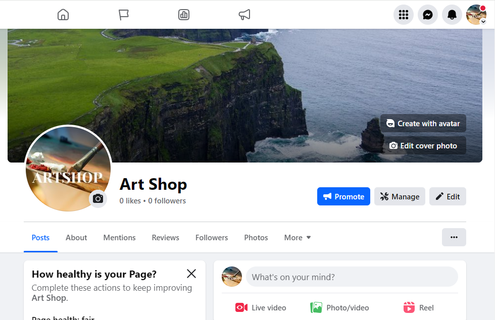
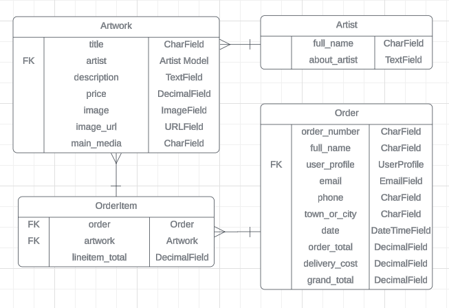

# Art Shop E-Commerce Application

## Purpose

* The external user goal is to view and purchase limited edition prints by local artists online.
* The internal user goal is to provide a means of selling limited edition prints by local artists online.
* The site is targeted at those interested in buying art particularly from artists based in 
Dublin, as well as those interested in conversations about art and supporting the local artist community.

## Deployed Site
* The live version can be accessed here: [Art Shop](https://art-shop-ecommerce-71a1569e3f02.herokuapp.com/)

## Deployed Site Images

## E-Commerce Business Model & Marketing

### Business Model

Income is generated through the sale of prints with a share of profit going directly to the artist and the other to the site owner.

### SEO & Marketing

The key marketing strategy is social media marketing with the aim of building trust and a community through regular interviews with the artists who sell on the website and sharing of the stories behind the art. Both Facebook and Instagram will be used.

#### Artist Spotlight

#### SEO

In order to facilitate higher search engine rankings, the following were implemented:
* Careful consideration of possible keywords that users may use to search for sites 
similar to this one. Inclusion of those keywords in the meta tags.
* The use of semantic HTML to highlight important information throughout the site and the
inclusion of keywords where appropriate in headings.
* Inclusion of a sitemap.xml file.

#### SEO Areas to Improve

* Include links to useful and valuable websites for the users.
* Include useful content in the form of a blog with articles that are likely to prove
useful to target users and bring traffic to the website.

## AGILE Methodology

### MILESTONES - EPICS - SPRINTS

* An Agile approach was taken. Possible features were listed and evaluated based on the value they could provide to the user, and their feasibility in terms of time and resources.
* An initial milestone was set on Github for target of minimum functionality.
* Due to the limited time available for completion of the project, only one sprint was completed. 
* Work items that were not listed as part of the first sprint, deemed not being crucial for minimum functionality, were moved to a Product Backlog also on Github.
* All items that were part of the completed sprint were converted into User Stories and managed on the Github Kanban board.  
* User Stories that could not be achieved during the sprint were moved back to the Product Backlog, to be evaluated and prioritised before any next sprint begins.

### USER STORIES

* Github Kanban board: User Stories were moved from 'To-do' to 'In Progress' to 'Complete' as work progressed.
* Tasks and Acceptance Criteria were identified and listed for user stories.

## UI & UX

The site is very basic in terms of design. Much work remains to be completed in terms of providing a more coherant and visually-appealing style.

### Layout

Layout follows conventions, particularly in the following:
* The main navigation is at the top of the page, and the same navigation is visible on every page. It
is possible to get to home, my basket, the products page or my account in one click.
* The basket is accessed by clicking on the basket icon in the top right of the page (and with the main navigation).
* 'My account' is accessed by clicking on a person icon to the left of the basket.
* Easily recognisable symbols (shopping basket, person) are used on buttons linking to the shopping
basket and account pages.
* The main page icon is in the top left (on the main navigation).
* Delivery information and social account links are located in the footer and are 
visible on every page.

### Wireframes

### Typography and Color

#### Typography

* The font 'Merienda' was used throughout the site for both headings and body text.
* The font 'Bungee Inline' was used for the site logo.
* Both fonts were chosen to lend the site a creative feel as the site is targeted 
at users who wish to buy art. 

#### Color

* #3c4142 (charcoal grey) was used for all key text, both headings and body as it is
less harsh than black while still providing high contrast with light backgrounds (thus
maintaining ease of readability).

### Accessibility

The following measures were taken to help ensure accessibility:
* All images include an 'alt' description.
* Where appropriate, HTML elements include 'aria-label' or 'aria-labelledby' attributes to describe 
the properties of elements to users visiting the site useing screen readers.
* The level of contrast between the background and any text through the site has been measured.
* Semantic HTML has been used throughout where appropriate to help make the purpose of elements clear to screen readers.

## Features

### CRUD

* Features were added to provide the user with CRUD (Create, Read, Update, Delete) functionality. 
* External users can view, update, delete and add items to their basket.
* External users complete and submit a front-end form during checkout.
* The admin user can create, read/view, update and delete both products and orders after logging in to the admin dashboard.

### Navigation Bar

* The navigation bar is located at the top of every page.
* The 'Artshop' icon/button in the top-left of the screen provides a link back to the 
home page.
* The 'Art' button brings the users directly to the product display page.
* The search bar in the center of the navigation bar allows the users to search for 
products using keywords including artist name, artwork title and media used.
* The 'person' icon in the top right of the screen provides a quick link to account
information via a drop-down menu. External users can register, log-in and log-out.
* At the very right of the screen, there is a basket icon. Clicking this icon brings 
the users to the basket page.
* The navigation bar is visible on all pages, providing quick links to all parts of 
the site.

### Sign Up, Log in and Log out

* The sign in, log in and log out pages are modified versions of the templates provided by
Allauth for user account and authentication.
* The sign in and log in form inputs use built-in Django validation to check that the user 
enters a suitable password and username. 
* Logged-in admin users can access the admin dashboard and view, edit, add and delete product,
user and order information.
 
### Home Page / Index.html

* When a user first arrives on the website, they see the main heading inviting them to view
art by local artists. There is a large button which links to the main product page.

### Products Page

* The main products page displays basic information about all available products including an
image, the title, the artist and the price.
* There is a button under each product linking the user to a detailed information page for 
that product.

### Detailed Product Page

* Clicking on any product on the products page will bring the user to a detailed page for
that product.
* The user will see a large image of the product and detailed information. 
* There is an 'Add to Basket' button under the product information.

### My Basket Page

* The basket page displays a list of all items in the basket including their title, order_number and price.
* There is a button next to each item allowing users to delete the items they do not want to buy.
* The grand_total including delivery is displayed at the bottom of the page above the Secure Checkout button.

### The Checkout Page

* The checkout page includes a form in which the user can enter their personal details, their 
delivery information and their payment information.
* There is an option for the user to save their information by checking a box.

### The Checkout Success Page

* The checkout success page displays a message stating that the order was successful and the order 
information.

### Toast Alerts

* Toast alerts inform the user of successful actions such as adding or removing an item from the basket, or the completion of an order.
* Toasts are also used to let the user know when there has been an error and an action cannot be carried out.

### Custom 404 Error Page

* A custom 404 page is displayed when a user attempts to navigate to a non-existant page on the website.

### Static Content Pages: Delivery Information & About Page

* Further information about the company and delivery is provided on the 'Delivery' and 'About' pages.

### Checkout Page

* Display a form in which the user can enter their address and payment information.
* Logged in users will find this form prepopulated with saved address details.

### My Profile Page

* Displays saved user information and order history.
* Can only be accessed by a logged in user.
* The user can add, save, change and delete personal details.

### Order Confirmation

* Displays a success message and key order information.

### Stripe Credit Card Payments

* Payments by credit card are handled by stripe.
* The card element follows Stripe styling with some minor modifications.
* The user must enter their card number, expiry date and three-digit code.

## Future Features

* Order confirmation emails to be sent to users after successfully completing a purchase.
* A footer containing important links such as to detailed delivery information and 
social media pages.
* An order summary to be displayed on the checkout page.
* Alternative payment options to be provided when checking out.
* A hero image on the home page.
* Improved styling and layout to be added throughout the site.
* A more extensive collection of artwork, each with relevant data.
* Admin users can currently only access the admin dashboard to view, edit, save or delete order, product and user information via the '/admin' URL. In the future, links (via buttons) will be added to the site 
for the admin user to access that information.  

## Data Model

Custom data models were created as described below.

### Model 1: Artwork

* The Artwork Model in the 'products' app specifies the information to be stored about any piece of art in the database for this application.
* Fields include the title, artist, price, description and media. 
* The relationship is a One-to-Many relationship with the Artist Model as one artist can have multiple works of art for sale at one time.

### Model 2: Artist

* The Artist Model specifies the information to be stored about each artist in the database.
* Fields include the full_name of the artist, and an about_artist attribute.

### Models 3, 4: Order, OrderItem

* The checkout app has both an Order model and an OrderItem model.
* The OrderItem model is customised for order items in this application. Fields include the order,
the artwork and the lineitem_total.

### Additional Models

* The 'profile' app uses a Profile model to store useful information about users.

### Entity Relationship Diagram (ERD)

The Models used in the products and checkout apps in this project were mapped out as in the Entity Relationship Diagram below.

## Django MVT Structure

* The website was built using the model-view-template structure in Django.
* All views created are function-based.

## Templates

* A base template was created to store the navigation bar and footer which appears on each page. All other templates extend this base template.
* All Allauth account templates use modified versions of the original allauth templates. The templates 
were modified to fit the style of the website while keeping their original functionality.

## Technology

### Planning

* Figma was used for the creation of wireframes.
* LucidChart was used to create Entity Relationship Diagrams (ERDs). 
* AGILE TOOL: Github Boards was used as the primary Agile tool for the listing of User Story information, prioritization and organisation into sprints and milestones. 

### Development

* Gitpod was used for editing.
* Github was used for storing, sharing the repository and version control. Github Boards
were used to store and plan user story, sprint, milestone and other required information
as part of the Agile method and approach to workflow.

#### Styling

* Bootstrap classes and styles were used throughout the application with some modification.
* Fonts were sourced from Google Fonts.
* All icons used are Bootstrap icons.

#### Testing

* Chrome Developer Tools was used for responsiveness testing.

#### User Authentication

* Allauth was used for log-in, log-out, and sign-up authentication. 

#### Payments

* Stripe was used to handle secure checkout and payment by credit card.

### Deployment

* Heroku was used to deploy the application.

#### Data / Relational Database

* ElephantSQL was used to store the database once deployed.

#### Static & Media Files

* AWS was used to store static and media files after deployment.

## Testing

### Code Validation 

* Python code was passed through the [Code Institute Python Linter](https://pep8ci.herokuapp.com/). No issues were found.

* HTML code in the template files was validated using the [W3 Validator](https://validator.w3.org/nu/). 

* CSS code was validated using the [W3C CSS Validator](https://jigsaw.w3.org/css-validator/validator).
No errors were found.

### Manual Testing

#### Functionality

##### Authorisation & Security

 | Functionality Tested                          | Development                | Production           | 
 | :-------------------------------------------  | :-----------------------   | :------------------- |
 | New user can register                             | Yes                | Yes           | 
 | Registered user can log in and out            | Yes                | Yes           | 
 | Registered user can view, edit, update own profile info on profile page                         | Yes                | Yes           | 
 | Profile and checkout pgs not accessible to logged out users via URL                          | Yes                | Yes           | 
 | 'My Profile' and 'Log Out' buttons in navigation only visible to logged in users                         | Yes                | Yes           | 
 | Both logged in and out users can add, remove, view items from basket                          | Yes                | Yes           | 
 | Checkout page can only be accessed from 'Secure Checkout' button on basket page                         | Yes                | Yes           | 

##### Notifications & Confirmation Messages

| Functionality Tested                          | Development                | Production           | 
 | :-------------------------------------------  | :-----------------------   | :------------------- |
 | Confirmation message (toast) appears when item added to or removed from basket                             | Yes                | Yes           | 
 | Confirmation message (toast) appears when user logs in, out or registers                             | Yes                | Yes           | 
 | Successful order toast & page displayed when a purchase is completed successfully                             | Yes                | To be fixed           | 
 | Successful order page displays order details                             | Yes                | To be fixed           | 

##### Payments

| Functionality Tested                          | Development                | Production           | 
 | :-------------------------------------------  | :-----------------------   | :------------------- |
 | Both logged in and out users can complete checkout                             | Yes                | To be fixed           | 
 | All payments confirmed on Stripe website                             | Yes                | Yes           | 
 | Webhooks working.                             | Yes                | To be fixed           | 
 | Saved user profile information automatically displayed in checkout form                            | Yes                | To be fixed           | 

##### User Profile

| Functionality Tested                          | Development                | Production           | 
 | :-------------------------------------------  | :-----------------------   | :------------------- |
 | Saved user profile information can be viewed on 'My Profile' page                             | Yes                | Yes           | 
 | User's order history accurately displayed on 'My Profile' page                             | Yes                | To be fixed           | 
 | Profile information can be viewed, edited, updated, removed by user.                             | Yes                | Yes           | 

##### Admin

| Functionality Tested                          | Development                | Production           | 
 | :-------------------------------------------  | :-----------------------   | :------------------- |
 | Admin user can log in and out via Django admin log in at .../admin/           | 
 | Admin user can view, update, delete and add user, product and order information via the admin dashboard.                             | Yes                | Yes           | 

#### Responsiveness

* This app was tested for responsiveness using the Google Chrome browser and Chrome DevTools. It has not been tested on other browsers.

#### Payments

* Stripe was used to confirm payment events.
* Test payments were carried out using Stripe test card numbers.
* Extensive further testing needs to be carried out. 

### Automatic Testing

Automatic testing is not yet in place.

### Test Cases

#### Test Case 1

1. Open the live app. The user is shown a home page with a large heading inviting the user to view local art. The user notices that there is a 'View Gallery' button.
2. Click 'View Gallery'. The user is brought to the gallery/products page. The user notices that there are more products further down the page.
3. Scroll down the page. The user sees a piece of art that they like. The user notices the 'View Details' button under the piece of art.
4. Click the 'View Details' button. The user sees the detailed information page for that piece of art. 
The user notices the 'Add to Basket' button.
5. Click the 'Add to Basket' button.  The user notices a success message in the top right of the screen 
with an 'x' in the corner.
6. Click the 'x'. The success message disappears. The user notices the basket icon in the top-right of 
the screen.
7. Click the basket icon. The user sees the basket page with their item details in the 
basket. The user notices the 'Secure Checkout' button.
8. Click 'Secure Checkout'. The user sees the checkout form page. The user notices that the first 
field is active.
9. Type in personal details. The user notices the delivery information section.
10. Type in delivery details. The user notices the payment information section.
11. Type in payment details. The user notice the 'Complete Payment' button.
12. Click 'Complete Payment'. The user sees the loading icon and then the successful checkout page.

## Bugs

### Fixed Bugs

### Remaining Bugs

* Stripe webhooks are not yet set up correctly on the deployed site. In the event that a user closes the payment window before an order is created but after payment has been processed, there is no 
back-up system in place to ensure the order is created. 
* Payments can be completed in both development and production (and can be confirmed on Stripe), 
however, the payment success page only currently displays in development. (A 500 Error shows in 
the deployed application.)
* Stripe test cards are charged the correct amount during checkout (and the correct total is displayed in both the basket and at checkout). The Order History section, however, on 
the user's profile page, displays incorrect totals for each order.

## Deployment

### Via Gitpod

1. Go to http://github.com.
2. Open the 'SiobhanP1/art-shop-ecommerce-store' repository.
3. Click on 'Gitpod' to open a Gitpod workspace.
4. Enter the command `python3 manage.py runserver` in the terminal to run the program.

### Via Heroku

The program was deployed using Heroku by doing the following:

1. Go to http://github.com.
2. Open the 'SiobhanP1/art-shop-ecommerce-store' repository.
3. Go to https://www.heroku.com.
4. Select 'Create app'.
5. Give the app a unique name.
6. Go to 'Settings'.
7. Click 'Reveal Config Vars' and add the following keys and their
corresponding values:
* AWS_ACCESS_KEY_ID: from the AWS storage bucket
* AWS_SECRET_ACCESS_KEY: from the AWS storage bucket
* DATABASE_URL: add ElephantSQL database URL here
* SECRET_KEY: can be generated
* USE_AWS: True
* STRIPE_SECRET_KEY: from your Stripe account.
* STRIPE_PUBLIC_KEY: from Stripe account.
* STRIPE_WH_SECRET: 'Signing secret' under Webhook for your app URL.
* PRODUCTION: True
9. Go to 'Deploy' and then 'Deployment Method'.
10. Select 'Connect to Github'.
11. Enter the repository name.
12. Select 'Manual Deploy'. 
13. Click 'Deploy'.

### How to Fork this Repository

1. Go to http://github.com.
2. Create a Github account.
3. Open the 'SiobhanP1/art-shop-ecommerce-store' repository.
4. Click 'Fork' in the top-left of the screen.
5. Select 'Create a new fork'. 
6. A forked repository will be created in your Github account.

## Credits

* The initial template used to build the project was the ci-full-template provided for project use by Code Institute.
* Much of the process followed in the building of the application were those steps provided in the 
Code Institute Boutique Ado project.
* The Order and LineItem models are modified versions of those in the Boutique Ado project.

### Images

* The images used are copyright-free images from [Unsplash](https://unsplash.com/) and [Pexels](https://www.pexels.com/). In particular, the 
following images are featured: 
  * [sheep in field](https://www.pexels.com/photo/five-sheeps-on-pasture-during-golden-hour-1650919/)
  * [graffit portrait](https://unsplash.com/photos/floral-persons-portrait-graffiti-fT49QnFucQ8)
  * [hands](https://unsplash.com/photos/two-human-hands-painting-k39RGHmLoV8)
